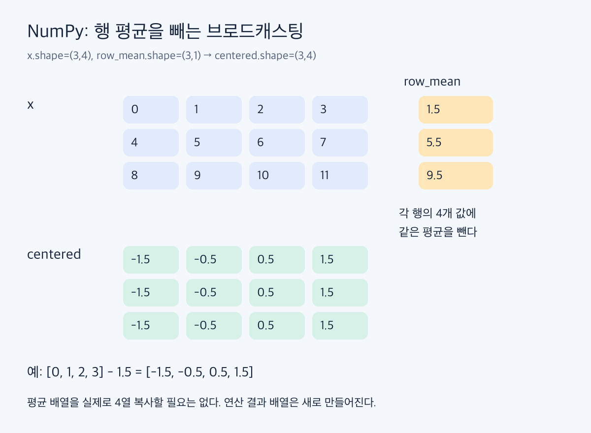

# 정규식과 NumPy: 텍스트에서 수치를 추출해 배열로 계산하기

정규식은 텍스트에서 구조를 찾고, NumPy는 추출한 수치를 배열로 계산한다. 두 도구를 연결할 때는 **무엇을 유효한 입력으로 인정할지**, **어떤 dtype과 shape으로 바꿀지**, **실패한 입력을 어떻게 처리할지**를 먼저 정한다.

## 1. 검색과 검증은 다르다

| 함수 | 의미 | 반환 |
|---|---|---|
| `re.match` | 문자열 시작에서 패턴을 맞춤 | Match 또는 None |
| `re.search` | 일치하는 첫 위치를 찾음 | Match 또는 None |
| `re.fullmatch` | 문자열 전체가 패턴인지 검사 | Match 또는 None |
| `re.findall` | 모든 비중첩 일치를 모음 | 문자열 또는 캡처 그룹들의 리스트 |
| `re.finditer` | 모든 비중첩 Match를 순차 반환 | 반복자 |

`match`는 시작 위치를 제한할 뿐 끝까지 소비한다고 보장하지 않는다. 형식 전체 검증에는 `fullmatch`가 명확하다. `finditer`는 결과 리스트를 한 번에 만들지 않지만, 이미 입력으로 받은 전체 문자열의 메모리까지 없애는 것은 아니다.

```python
import re

assert re.match(r"[0-9]+", "123abc").group() == "123"
assert re.fullmatch(r"[0-9]+", "123abc") is None
m = re.search(r"latency=(?P<ms>[0-9]+)ms", "INFO latency=42ms")
assert m is not None
assert m.group("ms") == "42"
assert m.span() == (5, 17)
```

`group(0)`은 전체 일치, `group(1)`은 첫 캡처, `groupdict()`는 이름 붙인 캡처의 사전이다. `span()`의 끝 위치는 Python 슬라이싱처럼 포함하지 않는다. 매치 실패 시 None을 먼저 확인해야 한다.

## 2. raw string과 기본 문법

Python 문자열 해석과 정규식 해석은 서로 다른 단계다. `r"\d+"`처럼 raw string을 쓰면 Python 문자열 단계의 백슬래시 이스케이프와 혼동을 줄일 수 있다. 정규식 엔진은 여전히 `\d`를 숫자 패턴으로 해석한다.

| 패턴 | 의미·주의점 |
|---|---|
| `.` | 기본적으로 줄바꿈 외 한 문자 |
| `[abc]`, `[a-z]` | 문자 집합 또는 범위 중 한 문자 |
| `[^0-9]` | ASCII 숫자가 아닌 한 문자 |
| `\d`, `\w`, `\s` | 숫자, 단어 문자, 공백; str 패턴은 기본 Unicode 기준 |
| `\b` | 단어 문자와 비단어 문자 사이 등의 경계 위치 |
| `*`, `+`, `?` | 0회 이상, 1회 이상, 0 또는 1회 |
| `{n}`, `{n,m}` | 지정 횟수 반복 |
| `^`, `$` | 시작·끝 위치; MULTILINE 등 플래그에 영향받음 |
| `A\|B` | A 또는 B 중 하나 |

`[a,b]`는 리스트가 아니다. 쉼표도 허용 문자다. `\w`는 영문·숫자·밑줄로만 한정되지 않아 한글도 매치할 수 있다. ASCII 숫자만 허용하려면 `[0-9]` 또는 적절한 ASCII 플래그를 사용한다. `$`는 마지막 줄바꿈 직전에도 일치할 수 있어 전체 검증을 대신한다고 단정하지 않는다.

```python
assert re.fullmatch(r"\w+", "한글_42") is not None
assert re.fullmatch(r"[A-Za-z0-9_]+", "한글_42") is None
assert re.findall(r"[a,b]", "a,b") == ["a", ",", "b"]
```

주요 플래그는 대소문자 무시 `re.I`, 줄별 앵커 `re.M`, 점이 줄바꿈도 포함하는 `re.S`다. raw string도 끝에 홀수 개의 백슬래시를 둘 수 없는 등 Python 문자열 문법의 제약을 받는다.

## 3. 그룹: 묶기, 추출, 실제 문자열 재참조

- `(pattern)`: 캡처 그룹.
- `(?:pattern)`: 묶되 캡처하지 않는 그룹.
- `(?P<name>pattern)`: 이름 붙인 캡처.
- `(?P=name)`: 앞에서 그 이름으로 **실제 매치한 문자열**을 다시 요구.

역참조는 패턴을 단순 재사용하는 것이 아니다. 예를 들어 두 단어의 형식이 같기만 한 경우와 두 단어의 내용까지 같은 경우를 구별한다.

```python
assert re.fullmatch(r"(?P<word>\w+)\s+(?P=word)", "go go")
assert re.fullmatch(r"(?P<word>\w+)\s+(?P=word)", "go stop") is None
assert re.findall(r"(pdf|csv)", "a.pdf b.csv") == ["pdf", "csv"]
assert re.findall(r"\w+\.(?:pdf|csv)", "a.pdf b.csv") == ["a.pdf", "b.csv"]
```

`findall`은 캡처 그룹이 있으면 결과 형태가 달라진다. 캡처가 하나면 그 그룹의 문자열, 여러 개면 그룹들의 튜플을 반환한다. 그룹 없이 전체 일치가 필요하면 비캡처 그룹을 사용하거나 `finditer`의 `group(0)`을 읽는다.

## 4. 탐욕성, 전후방 탐색, 경계

수량자는 기본적으로 가능한 많이 소비한다. `.*?`처럼 `?`를 붙이면 전체 패턴을 만족하는 범위에서 적게 소비하려 한다. “항상 가장 짧은 문자열만 찾는다”보다 **나머지 패턴의 성공까지 함께 고려한다**고 이해하는 편이 정확하다.

```python
assert re.findall(r"<.*>", "<b>x</b>") == ["<b>x</b>"]
assert re.findall(r"<.*?>", "<b>x</b>") == ["<b>", "</b>"]
```

이 예제가 일반 HTML 파서를 대체하지는 않는다. 중첩 구조와 속성·이스케이프를 다루려면 해당 형식의 파서를 쓴다.

| 문법 | 확인하는 조건 |
|---|---|
| `(?=X)` | 뒤에 X가 있음 |
| `(?!X)` | 뒤에 X가 없음 |
| `(?<=X)` | 앞에 X가 있음 |
| `(?<!X)` | 앞에 X가 없음 |

이들은 위치의 조건을 검사하고 그 조건 문자열 자체를 소비하지 않는다. Python 표준 `re`의 후방 탐색은 고정 길이 제약을 갖는다.

### 부정 조건만 붙이면 숫자 일부가 새어 나온다

```python
assert re.findall(r"\d+(?!개)", "12개 34원") == ["1", "34"]
assert re.findall(r"(?<!\d)\d+(?!\d|개)", "12개 34원") == ["34"]
assert re.findall(r"(?<!-)\d+", "-120 30") == ["20", "30"]
assert re.findall(r"(?<![-\d])\d+", "-120 30") == ["30"]
```

`12개`의 전체 숫자 12는 뒤의 `개` 때문에 실패하지만, 엔진이 숫자 반복을 줄여 1만 매치하면 다음 글자가 2라서 부정 조건을 통과한다. 숫자 중간에서 시작하거나 끝나는 것도 막아야 한다. 위 교정 패턴은 공백으로 구분된 정수와 표시된 단위를 전제로 하며 소수·지수 표기까지 검증하는 범용 수 파서는 아니다.

여러 단어 존재 여부의 AND 조건은 lookahead를 연속으로 두어 표현할 수 있다. 단어 경계를 포함한 패턴을 줄마다 적용하면 `pdfx`처럼 부분 문자열인 경우를 구별하기 쉽다.

## 5. ndarray를 읽는 세 가지 정보

`ndim`은 축 개수, `shape`은 각 축의 길이, `dtype`은 원소 저장 타입이다. 배열은 동일한 dtype으로 원소를 다루므로 Python 객체별 연산 비용을 줄일 수 있다. 숫자 배열에서 큰 장점이 있지만 `object` dtype이나 아주 작은 배열까지 항상 빠르다고 일반화하지 않는다.

```python
import numpy as np

a = np.arange(12).reshape(3, 4)
assert a.ndim == 2
assert a.shape == (3, 4)
assert a[1, 2] == 6
assert a[:, 1:3].shape == (3, 2)
assert a[1].shape == (4,)
assert a[1:2].shape == (1, 4)
```

정수 인덱싱은 그 축을 제거하고, 슬라이싱은 축을 유지한다. `...`는 지정하지 않은 축들을 뜻한다. 예를 들어 shape `(2,3,4)`에서 `x[..., :2]`는 `(2,3,2)`다.

## 6. 벡터화와 브로드캐스팅

벡터화는 Python에서 원소마다 반복하는 대신 배열 연산을 호출하는 방식이다. 반복 자체가 없어지는 것은 아니고 NumPy 내부에서 수행된다. 브로드캐스팅은 모양이 다른 배열의 축을 맞춰 연산하는 규칙이다.

오른쪽 축부터 비교하여 **같거나, 한쪽이 1**이면 맞출 수 있다. 없는 왼쪽 축은 1처럼 취급한다.

| 왼쪽 shape | 오른쪽 shape | 결과 |
|---|---|---|
| (2,3,4) | (3,4) | (2,3,4) |
| (3,1) | (1,4) | (3,4) |
| (3,4) | (3,) | 불가: 마지막 4와 3 충돌 |
| (3,4) | (3,1) | (3,4) |

입력을 논리적으로 확장하는 과정에 같은 값을 실제로 반복 복사할 필요는 없다. 그러나 `a+b`의 **결과 배열**이나 복합 수식의 중간 배열은 메모리를 사용한다. “브로드캐스팅이므로 추가 메모리 0”은 아니다.

```python
x = np.arange(12, dtype=float).reshape(3, 4)
row_mean = x.mean(axis=1, keepdims=True)
centered = x - row_mean
assert row_mean.shape == (3, 1)
assert np.allclose(centered.mean(axis=1), 0)
```



## 7. axis와 keepdims

집계에서 axis는 줄여 없앨 축이다. `(3,4)`의 `sum(axis=0)`은 첫 축 길이 3을 줄여 `(4,)`, `sum(axis=1)`은 두 번째 축 길이 4를 줄여 `(3,)`가 된다. `keepdims=True`는 줄인 축을 길이 1로 남겨 원래 배열과 다시 연산하기 쉽게 한다.

| 작업 | 주요 도구 | 확인할 조건 |
|---|---|---|
| 간격으로 수열 생성 | `arange` | stop 미포함; 실수 간격 반올림 주의 |
| 개수로 구간 생성 | `linspace` | num은 개수, endpoint 기본 포함 |
| 모양 변경 | `reshape`, `expand_dims`, `squeeze` | 원소 수와 길이 1인 축 |
| 축 변경·추가 | `transpose`, `stack` | transpose는 축 순서, stack은 새 축 |
| 조건 처리 | `where`, `isin`, `any`, `all` | 배열 조건의 shape |
| 통계 | `sum`, `mean`, `median`, `std`, `percentile` | axis, 결측값, dtype |
| 위치·순서 | `argmax`, `argmin`, `argsort` | 값이 아닌 인덱스 반환 |
| 범위·빈도 | `clip`, `unique` | 원소 제한 또는 고유값·개수 |

`std`는 기본 `ddof=0`이며 표본 표준편차가 목적이면 정의에 맞춰 설정한다. `nanmean` 같은 함수는 NaN을 제외하지만 전부 결측인 경우 등은 별도 처리가 필요하다. 고정 폭 정수의 오버플로우는 dtype 선택으로 관리한다. `reshape`가 항상 뷰라는 보장도 없다.

## 8. 슬라이스는 뷰, 고급 인덱싱으로 읽으면 복사

```python
original = np.arange(6)
view = original[1:4]
copy = original[[1, 2, 3]]
view[0] = 99
copy[1] = 88
assert original.tolist() == [0, 99, 2, 3, 4, 5]
assert np.shares_memory(original, view)
assert not np.shares_memory(original, copy)
```

기본 슬라이스는 원본 메모리를 공유한다. 정수 배열·불리언 마스크로 고급 인덱싱해서 얻은 배열은 복사본이다. 단, `a[mask] = value`처럼 **원본을 대입 대상으로 쓰면 원본을 수정**한다. 읽기 결과가 복사라는 말과 혼동하지 않는다.

```python
matrix = np.arange(9).reshape(3, 3)
assert matrix[[0, 2], [1, 2]].tolist() == [1, 8]
assert matrix[np.ix_([0, 2], [1, 2])].tolist() == [[1, 2], [7, 8]]
mask = (matrix > 2) & (matrix < 6)
assert matrix[mask].tolist() == [3, 4, 5]
```

두 인덱스 배열을 함께 주면 대응하는 좌표 쌍을 선택한다. 모든 행·열 조합의 부분행렬은 `np.ix_`로 표현한다. 배열 조건은 `and/or` 대신 `&/|`를 쓰고 각 비교를 괄호로 묶는다. 마스크가 전체 배열과 같은 shape이면 선택 결과는 True 위치를 모은 1차원 배열이다. 행 마스크를 사용하면 선택된 행 구조를 유지한다.

## 9. 정규식에서 NumPy까지 연결하기

다음 예제는 한 줄이 `sensor_정수: 부호가 있을 수 있는 숫자 unit` 형식인지 전체 검사한다. 실패한 행은 개수를 따로 기록한다. 숫자 문법은 정수 또는 소수점 뒤 숫자가 있는 십진수로 한정하고, 지수 표기와 NaN은 받지 않는다.

```python
raw = """sensor_1: 10.5 unit
sensor_2: -2 unit
sensor_3: error
sensor_4: 7.5 unit"""
pattern = re.compile(
    r"sensor_(?P<id>[0-9]+):\s*"
    r"(?P<value>[+-]?[0-9]+(?:\.[0-9]+)?)\s+unit"
)
values = []
rejected = 0
for line in raw.splitlines():
    match = pattern.fullmatch(line.strip())
    if match is None:
        rejected += 1
    else:
        values.append(float(match.group("value")))

measurements = np.array(values, dtype=np.float64)
mean = measurements.mean() if measurements.size else None
assert measurements.tolist() == [10.5, -2.0, 7.5]
assert rejected == 1
assert np.isclose(mean, 16 / 3)
```

한 줄의 일부 숫자만 조용히 추출하지 않도록 전체 검증을 선택했다. 유효 데이터가 없을 때 평균을 계산하지 않고 None으로 처리한다. 누락이 중요한 분석이라면 오류 행을 버리는 대신 센서 ID와 결측 상태를 함께 보존해야 한다.

## 10. 주의점과 복습

- `match`만으로 문자열 전체를 검증할 수는 없다. 전체 형식 검증에는 `fullmatch`를 사용한다.
- `\d`, `\w`는 기본적으로 Unicode 의미를 따른다. ASCII 범위가 필요하면 패턴이나 플래그로 제한한다.
- 역참조는 패턴 재사용이 아니라 앞서 일치한 문자열의 재사용이다.
- `\d+(?!개)`는 숫자 일부를 매치할 수 있다. 위 반례를 실행해 확인했다.
- 연속 메모리는 일반적인 수치 배열의 이점이다. 전치·슬라이스 뷰는 비연속일 수 있다.
- `keepdims`는 브로드캐스팅을 편하게 하지만 수동 차원 추가로 대체할 수 있어 필수 문법은 아니다.
- 안정 정렬 옵션은 안정성을 요청하는 의미로 이해한다. `mergesort`와 `stable`의 내부 구현이 모든 dtype에서 동일하다고 보장하지 않는다.

본문 모든 코드 블록을 자동화 도구로 실행했다. 부분 일치 반례, Unicode, 그룹 결과, 브로드캐스팅 shape, 공유 메모리, 좌표 선택, 정제 결과와 실패 행 수를 검증했다. 실제 대규모 로그의 처리 성능은 측정하지 않았다.

복습 질문: 전체 검증과 부분 추출 중 무엇이 필요한가? 캡처가 `findall` 반환형을 바꾸는가? 집계 뒤 어느 축이 남는가? 선택 결과를 고치는가, 원본의 선택 위치에 대입하는가?

공개 참고 자료: [Python re](https://docs.python.org/3/library/re.html), [NumPy 브로드캐스팅](https://numpy.org/doc/stable/user/basics.broadcasting.html), [배열 인덱싱](https://numpy.org/doc/stable/user/basics.indexing.html), [NumPy 기초](https://numpy.org/doc/stable/user/absolute_beginners.html), [argsort](https://numpy.org/doc/stable/reference/generated/numpy.argsort.html).

검증 환경: Python 3.11.9, NumPy 2.4.6, macOS arm64. 공식 문서 확인일: 2026-09-17.
