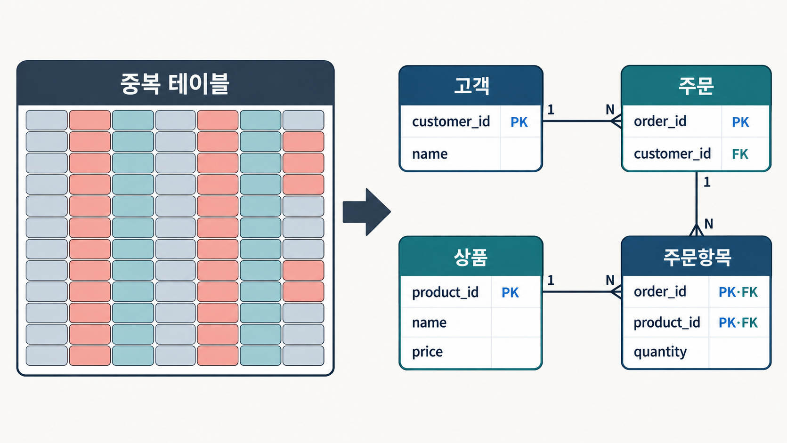

관계형 데이터베이스를 처음 배우면 `CREATE TABLE` 문법부터 외우기 쉽다. 하지만 좋은 테이블은 문법보다 먼저 **무엇을 한 행으로 볼지, 어떤 값으로 행을 식별할지, 테이블 사이의 관계를 어떻게 지킬지**를 결정한 결과다. 이 글에서는 모델링, 키, 무결성, 정규화, DDL을 하나의 흐름으로 연결한다.

## 1. 테이블은 현실의 대상을 행과 열로 표현한다

관계형 데이터베이스는 데이터를 테이블로 표현한다. 열(column)은 이름, 가격처럼 대상이 가진 속성이고, 행(row)은 한 고객이나 한 상품처럼 속성값을 모은 하나의 기록이다.

예를 들어 온라인 서점이라면 처음부터 모든 정보를 한 표에 넣기보다 다음처럼 역할을 나눌 수 있다.

- `customers`: 고객 한 명을 한 행으로 저장
- `products`: 상품 한 개를 한 행으로 저장
- `orders`: 주문 한 건을 한 행으로 저장
- `order_items`: 주문에 포함된 상품과 수량을 저장

여기서 가장 먼저 답해야 할 질문은 “이 행을 다른 행과 구분하는 값은 무엇인가?”다.

## 2. 기본키와 외래키는 식별과 연결을 담당한다

**기본키(Primary Key)** 는 테이블의 각 행을 유일하게 식별한다. 기본키 값은 중복될 수 없고 `NULL`일 수도 없다. 이름이나 이메일처럼 바뀔 수 있는 값보다 별도의 식별자를 두는 경우가 많은 이유다.

**외래키(Foreign Key)** 는 자식 테이블의 값이 부모 테이블의 실제 행을 가리키도록 만든다. `orders.customer_id`가 `customers.customer_id`를 참조한다면, 존재하지 않는 고객 번호로 주문을 만드는 일을 데이터베이스가 막을 수 있다.

```sql
CREATE TABLE customers (
    customer_id BIGINT AUTO_INCREMENT,
    name VARCHAR(50) NOT NULL,
    email VARCHAR(255) NOT NULL,
    PRIMARY KEY (customer_id),
    UNIQUE (email)
);

CREATE TABLE orders (
    order_id BIGINT AUTO_INCREMENT,
    customer_id BIGINT NOT NULL,
    ordered_at DATETIME NOT NULL DEFAULT CURRENT_TIMESTAMP,
    PRIMARY KEY (order_id),
    CONSTRAINT fk_orders_customer
        FOREIGN KEY (customer_id)
        REFERENCES customers(customer_id)
);
```

기본키는 “이 행이 누구인가”를, 외래키는 “이 행이 누구와 연결되는가”를 표현한다.

## 3. 무결성은 잘못된 상태를 저장하지 못하게 하는 규칙이다

무결성 제약은 애플리케이션의 실수를 데이터베이스 경계에서도 막는다.

| 종류 | 지키려는 것 | 대표 수단 |
|---|---|---|
| 개체 무결성 | 각 행을 유일하게 식별 | `PRIMARY KEY` |
| 참조 무결성 | 관계가 실제 부모 행을 가리킴 | `FOREIGN KEY` |
| 도메인 무결성 | 열에 허용된 종류와 범위만 저장 | 자료형, `NOT NULL`, `CHECK` |

```sql
CREATE TABLE products (
    product_id BIGINT AUTO_INCREMENT PRIMARY KEY,
    name VARCHAR(100) NOT NULL,
    price DECIMAL(10, 2) NOT NULL,
    stock INT NOT NULL DEFAULT 0,
    CHECK (price >= 0),
    CHECK (stock >= 0)
);
```

`VARCHAR`, `DECIMAL`, `DATE` 같은 자료형도 설계의 일부다. 금액에 부동소수점형을 무심코 쓰거나, 날짜를 문자열로 저장하면 나중에 비교·정렬·계산이 어려워질 수 있다. 열이 반드시 필요한 값이라면 `NOT NULL`로 의도를 드러낸다.

## 4. 모델링은 요구사항을 제약조건으로 번역하는 과정이다

테이블부터 만들지 말고 다음 순서로 생각하면 수정 비용이 줄어든다.

1. **요구사항 분석**: 저장할 대상, 업무 규칙, 필요한 조회를 찾는다.
2. **개념적 모델링**: 고객·주문·상품 같은 개체와 관계를 그린다.
3. **논리적 모델링**: 속성, 기본키, 외래키, 정규화된 테이블을 결정한다.
4. **물리적 모델링**: 실제 DBMS의 자료형, 인덱스, 제약조건으로 구현한다.

예를 들어 “한 주문에는 여러 상품이 들어가고, 한 상품은 여러 주문에 들어갈 수 있다”는 다대다 관계다. 관계형 테이블에서는 이를 `order_items`라는 연결 테이블로 풀어낸다.

```sql
CREATE TABLE order_items (
    order_id BIGINT NOT NULL,
    product_id BIGINT NOT NULL,
    quantity INT NOT NULL,
    unit_price DECIMAL(10, 2) NOT NULL,
    PRIMARY KEY (order_id, product_id),
    FOREIGN KEY (order_id) REFERENCES orders(order_id),
    FOREIGN KEY (product_id) REFERENCES products(product_id),
    CHECK (quantity > 0),
    CHECK (unit_price >= 0)
);
```

복합 기본키는 같은 주문에 같은 상품 행이 중복되는 것을 막는다. 주문 당시 가격을 `unit_price`로 따로 저장한 것은 상품의 현재 가격이 바뀌어도 과거 주문 금액을 보존하기 위해서다. 현실의 규칙을 어느 테이블과 열에 담을지가 모델링의 핵심이다.

## 5. 정규화는 중복 때문에 생기는 이상 현상을 줄인다

고객, 주문, 상품 정보를 한 테이블에 반복 저장하면 세 가지 문제가 생긴다.

- **삽입 이상**: 주문이 없는 새 상품을 등록하기 어렵다.
- **갱신 이상**: 같은 고객 주소가 여러 행에 있어 일부만 수정될 수 있다.
- **삭제 이상**: 마지막 주문을 지웠더니 상품 정보까지 사라질 수 있다.

정규화는 속성 사이의 함수적 종속을 살펴 테이블을 적절히 분해하는 과정이다.

- **제1정규형(1NF)**: 한 칸에는 하나의 값만 둔다.
- **제2정규형(2NF)**: 복합키의 일부에만 의존하는 속성을 분리한다.
- **제3정규형(3NF)**: 기본키가 아닌 속성을 거쳐 간접적으로 결정되는 속성을 분리한다.
- **BCNF**: 모든 결정자가 후보키가 되도록 더 엄격하게 점검한다.

후보키는 행을 유일하게 식별하면서, 어떤 구성 요소도 더 뺄 수 없는 최소성을 가진다. 실무에서는 무조건 가장 높은 정규형을 목표로 하기보다 중복과 일관성 위험, 조회 패턴을 함께 본다. 먼저 올바른 구조를 만들고, 성능 때문에 비정규화한다면 중복값을 어떻게 동기화할지도 설계해야 한다.



## 6. DDL은 설계 결정을 데이터베이스에 새긴다

DDL(Data Definition Language)은 구조를 정의한다.

- `CREATE`: 데이터베이스나 테이블 생성
- `ALTER`: 기존 테이블의 열·제약조건 변경
- `DROP`: 객체 자체 제거
- `TRUNCATE`: 테이블 구조는 남기고 모든 행 제거

```sql
ALTER TABLE products
    ADD COLUMN description TEXT NULL;

ALTER TABLE products
    MODIFY COLUMN name VARCHAR(150) NOT NULL;
```

운영 데이터가 있는 테이블을 변경할 때는 새 제약조건을 기존 행이 만족하는지, 잠금이나 재구성이 발생하는지, 되돌릴 방법이 있는지 먼저 확인한다.

`DELETE FROM products;`와 `TRUNCATE TABLE products;`는 모두 전체 행을 없앨 수 있지만 같은 명령이 아니다. MySQL에서 `TRUNCATE TABLE`은 DDL로 취급되며 `WHERE` 조건을 붙일 수 없고, 자동 증가 값도 시작값으로 재설정한다. 외래키 참조가 있거나 트랜잭션 복구가 필요한 상황에서는 특히 차이를 확인해야 한다.

## 7. AUTO_INCREMENT는 식별자 생성 도구이지 순번표가 아니다

```sql
CREATE TABLE notes (
    note_id BIGINT AUTO_INCREMENT PRIMARY KEY,
    body TEXT NOT NULL
);
```

`AUTO_INCREMENT`는 새 행에 고유한 정수 식별자를 부여하기 편리하다. 그러나 값이 항상 1씩 빈틈없이 이어진다고 가정하면 안 된다. 실패하거나 롤백된 삽입, 동시 작업, 명시적인 값 입력 등으로 번호가 비어 있을 수 있다. 따라서 “오늘의 17번째 주문”이나 화면의 연속 순번처럼 빈틈 없는 업무 번호로 사용하지 않는다.

기본키가 필요한 이유는 행의 정체성을 안정적으로 참조하기 위해서다. 숫자의 연속성은 기본키의 조건이 아니다.

## 8. 설계할 때 확인할 체크리스트

- 한 행이 나타내는 대상을 한 문장으로 설명할 수 있는가?
- 모든 테이블에 행을 안정적으로 식별할 키가 있는가?
- 다대다 관계를 연결 테이블로 풀었는가?
- 중복 저장된 사실 때문에 삽입·수정·삭제 이상이 생기지 않는가?
- 필수값, 범위, 중복 금지, 참조 관계를 제약조건으로 표현했는가?
- 자료형이 실제 값의 의미와 계산 방식을 반영하는가?
- `AUTO_INCREMENT` 값의 연속성을 업무 규칙으로 오해하지 않았는가?
- 구조 변경과 전체 삭제 전에 영향 범위와 복구 방법을 확인했는가?

## 복습 질문

1. 기본키와 `UNIQUE NOT NULL` 제약은 어떤 점이 같고 다른가?
2. 주문과 상품 사이에 연결 테이블이 필요한 이유는 무엇인가?
3. 고객 주소를 모든 주문 행에 반복 저장하면 어떤 이상 현상이 생길 수 있는가?
4. `AUTO_INCREMENT`에 빈 번호가 생겨도 기본키 역할에는 문제가 없는 이유는 무엇인가?

공개 참고 자료: [MySQL 8.4 CREATE TABLE](https://dev.mysql.com/doc/refman/8.4/en/create-table.html), [MySQL 8.4 외래키 제약조건](https://dev.mysql.com/doc/refman/8.4/en/create-table-foreign-keys.html), [MySQL 8.4 TRUNCATE TABLE](https://dev.mysql.com/doc/refman/8.4/en/truncate-table.html).
