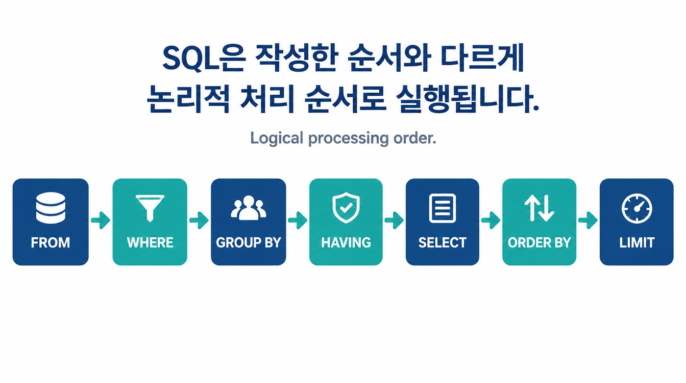

SQL 조회문은 위에서 아래로 읽히지만, 데이터베이스가 논리적으로 처리하는 순서는 그렇게 단순하지 않다. 이 차이를 이해하면 `NULL` 비교가 왜 실패하는지, 집계 결과를 왜 `WHERE`에서 거를 수 없는지, `LIMIT`만 쓴 결과가 왜 매번 같다고 보장할 수 없는지를 설명할 수 있다.

이 글에서는 데이터 변경의 안전 수칙부터 `SELECT`, 필터링, 정렬, 집계, `HAVING`까지 하나의 주문 테이블로 연결한다.

## 1. 데이터 변경문은 WHERE부터 확인한다

DML(Data Manipulation Language)은 행을 추가·수정·삭제한다.

```sql
INSERT INTO products (name, price, stock)
VALUES ('키보드', 45000, 10);

UPDATE products
SET stock = stock - 1
WHERE product_id = 1;

DELETE FROM products
WHERE product_id = 1;
```

`UPDATE`와 `DELETE`에서 `WHERE`를 생략하면 조건에 맞는 일부 행이 아니라 모든 행이 대상이 된다. 실제 변경 전에 같은 조건의 `SELECT`로 대상 행을 확인하고, 중요한 작업은 트랜잭션과 백업·복구 절차 안에서 수행한다.

```sql
SELECT product_id, name, stock
FROM products
WHERE product_id = 1;
```

`DELETE`는 `WHERE`로 일부 행을 지울 수 있다. `TRUNCATE TABLE`은 테이블의 모든 행을 빠르게 비우는 DDL이며 조건을 붙이지 못한다. 두 문장을 단순히 “느린 삭제와 빠른 삭제”로만 외우면 트랜잭션, 외래키, 자동 증가 값의 차이를 놓치기 쉽다.

## 2. SELECT는 필요한 열과 행을 정한다

```sql
SELECT order_id, customer_id, total_amount
FROM orders;
```

`SELECT`는 결과에 보여 줄 열을, `FROM`은 데이터를 가져올 대상을 정한다. 학습 중에는 `SELECT *`가 편하지만, 실제 코드에서는 필요한 열을 명시하면 결과 구조와 데이터 이동량을 예측하기 쉽다.

중복값을 하나씩만 보고 싶다면 `DISTINCT`를 사용한다.

```sql
SELECT DISTINCT status
FROM orders;
```

`DISTINCT`는 선택한 열 조합 전체를 기준으로 중복을 제거한다. `SELECT DISTINCT customer_id, status`라면 고객 번호와 상태의 조합이 같은 행만 중복이다.

## 3. WHERE는 행 단위 조건을 표현한다

```sql
SELECT order_id, total_amount
FROM orders
WHERE total_amount >= 50000;
```

범위, 목록, 패턴 조건도 사용할 수 있다.

```sql
-- 양 끝값을 포함한다.
WHERE total_amount BETWEEN 50000 AND 100000

-- 여러 값 중 하나와 일치한다.
WHERE status IN ('PAID', 'SHIPPED')

-- %는 0개 이상의 문자, _는 정확히 한 문자를 나타낸다.
WHERE customer_name LIKE '김%'
```

`LIKE`의 대소문자 구분은 문자 집합과 collation 설정의 영향을 받는다. 패턴 문법만 보고 모든 환경에서 같은 비교 결과가 나온다고 가정하지 않는다.

## 4. NULL은 값이 아니라 값이 없거나 알려지지 않은 상태다

`NULL`은 빈 문자열이나 숫자 0이 아니다. 그래서 다음 비교는 의도대로 동작하지 않는다.

```sql
-- 잘못된 방식
WHERE shipped_at = NULL
```

대신 `IS NULL` 또는 `IS NOT NULL`을 사용한다.

```sql
SELECT order_id
FROM orders
WHERE shipped_at IS NULL;
```

SQL의 조건식은 참, 거짓뿐 아니라 알 수 없음(UNKNOWN)을 포함하는 3값 논리로 이해해야 한다. `NULL = NULL`도 참이 아니라 UNKNOWN이다. `WHERE`는 결과가 참인 행만 남기므로 UNKNOWN인 행은 제외된다.

계산이나 출력에서 대체값이 필요할 때는 `COALESCE`를 사용할 수 있다.

```sql
SELECT order_id,
       COALESCE(shipping_memo, '메모 없음') AS shipping_memo
FROM orders;
```

`COALESCE(a, b, c)`는 왼쪽부터 처음 만나는 `NULL`이 아닌 값을 반환한다. 데이터 자체를 변경하는 것이 아니라 조회 결과를 표현하는 방식이다.

## 5. AND와 OR가 섞이면 괄호로 의도를 고정한다

MySQL에서는 `AND`가 `OR`보다 먼저 평가된다.

```sql
WHERE status = 'PAID'
   OR status = 'SHIPPED'
  AND total_amount >= 50000
```

이 조건은 다음과 같이 해석된다.

```sql
WHERE status = 'PAID'
   OR (status = 'SHIPPED' AND total_amount >= 50000)
```

유료 결제 또는 배송 완료인 주문 가운데 5만 원 이상만 찾으려는 의도라면 괄호가 필요하다.

```sql
WHERE (status = 'PAID' OR status = 'SHIPPED')
  AND total_amount >= 50000
```

연산자 우선순위를 알고 있어도, 여러 조건이 섞인 쿼리는 괄호로 업무 규칙을 드러내는 편이 안전하다.

## 6. ORDER BY가 있어야 결과 순서를 의도할 수 있다

```sql
SELECT order_id, ordered_at, total_amount
FROM orders
ORDER BY ordered_at DESC, order_id DESC;
```

`ASC`는 오름차순, `DESC`는 내림차순이다. 앞의 정렬 기준이 같을 때 다음 기준을 사용한다. `ORDER BY`가 없으면 조회 결과의 순서는 보장되지 않는다.

일부 행만 가져오려면 `LIMIT`를 사용한다.

```sql
SELECT order_id, ordered_at
FROM orders
ORDER BY ordered_at DESC, order_id DESC
LIMIT 10 OFFSET 20;
```

MySQL의 `OFFSET`은 0부터 시작한다. 안정적인 페이지 구분이 필요하다면 동률이 생기지 않도록 고유한 열까지 정렬 기준에 포함한다. 데이터가 자주 바뀌거나 페이지가 깊어지면 큰 `OFFSET` 대신 마지막으로 본 키를 기준으로 다음 페이지를 찾는 키셋 페이지네이션도 검토한다.

## 7. 집계 함수는 여러 행을 하나의 값으로 요약한다

대표적인 집계 함수는 `COUNT`, `SUM`, `AVG`, `MIN`, `MAX`다.

```sql
SELECT COUNT(*) AS order_count,
       SUM(total_amount) AS total_sales,
       AVG(total_amount) AS average_order_amount
FROM orders
WHERE status = 'PAID';
```

`COUNT(*)`는 조건을 통과한 행 수를 센다. `COUNT(shipped_at)`처럼 특정 표현식을 넣으면 그 표현식이 `NULL`이 아닌 행만 센다. 둘의 차이를 이용하면 아직 배송되지 않은 행 수를 계산할 수도 있다.

```sql
SELECT COUNT(*) - COUNT(shipped_at) AS not_shipped_count
FROM orders;
```

## 8. GROUP BY는 행을 그룹으로 묶고 HAVING은 그룹을 거른다

고객별 결제 주문 수와 합계를 구해 보자.

```sql
SELECT customer_id,
       COUNT(*) AS order_count,
       SUM(total_amount) AS total_sales
FROM orders
WHERE status = 'PAID'
GROUP BY customer_id;
```

`WHERE`는 그룹을 만들기 전에 개별 행을 거른다. 집계가 끝난 뒤 “결제 주문이 3건 이상인 고객”만 남기려면 `HAVING`을 사용한다.

```sql
SELECT customer_id,
       COUNT(*) AS order_count,
       SUM(total_amount) AS total_sales
FROM orders
WHERE status = 'PAID'
GROUP BY customer_id
HAVING COUNT(*) >= 3
ORDER BY total_sales DESC;
```

집계 함수를 `WHERE`에 쓰면 아직 그룹과 집계값이 만들어지기 전이라 올바르지 않다. MySQL에서는 `HAVING`과 `ORDER BY`에서 `SELECT` 별칭을 사용할 수 있지만, `WHERE`에서는 그 별칭을 사용할 수 없다.

또한 `GROUP BY`를 쓸 때는 그룹 기준도 아니고 집계하지도 않은 열을 무심코 `SELECT`하지 않는다. MySQL의 `ONLY_FULL_GROUP_BY` 설정에서는 함수적 종속이 인정되지 않는 이런 쿼리를 거부한다. 허용되는 설정에서도 어느 행의 값이 선택될지 의도가 불분명해질 수 있다.

## 9. 논리 실행 순서로 오류를 설명한다

`SELECT` 문을 작성하는 대표적인 순서는 다음과 같다.

```text
SELECT → FROM → WHERE → GROUP BY → HAVING → ORDER BY → LIMIT
```

하지만 이해를 위한 논리적 처리 순서는 다음처럼 볼 수 있다.

```text
FROM → WHERE → GROUP BY → HAVING → SELECT → ORDER BY → LIMIT
```



이 순서로 보면 여러 규칙이 한 번에 설명된다.

- `WHERE`는 아직 만들어지지 않은 집계 결과를 조건으로 쓸 수 없다.
- `HAVING`은 그룹화와 집계 뒤의 조건을 담당한다.
- `SELECT`에서 만든 별칭은 `WHERE` 시점에는 아직 존재하지 않는다.
- `ORDER BY`로 순서를 정한 뒤 `LIMIT`로 일부를 자른다.

실제 데이터베이스 옵티마이저는 같은 결과를 더 효율적으로 만들기 위해 물리적인 실행 방법을 바꿀 수 있다. 논리 순서는 쿼리의 의미와 작성 규칙을 이해하기 위한 모델이지, 엔진 내부 작업을 초 단위로 고정한 절차는 아니다.

## 10. 한 번에 연결해 보기

다음 쿼리는 결제된 주문만 대상으로 고객별 주문 수와 매출을 계산하고, 매출이 10만 원 이상인 고객 가운데 상위 5명을 찾는다.

```sql
SELECT customer_id,
       COUNT(*) AS order_count,
       SUM(total_amount) AS total_sales
FROM orders
WHERE status = 'PAID'
  AND ordered_at >= '2026-09-01'
  AND ordered_at <  '2026-10-01'
GROUP BY customer_id
HAVING SUM(total_amount) >= 100000
ORDER BY total_sales DESC, customer_id ASC
LIMIT 5;
```

날짜를 `BETWEEN '2026-09-01' AND '2026-09-30'`으로 쓰지 않고 다음 달 시작 시각 미만으로 표현하면 시간값이 포함된 열에서도 월 전체 범위를 명확하게 나타낼 수 있다.

## 복습 질문

1. `col = NULL`이 아니라 `col IS NULL`을 써야 하는 이유는 무엇인가?
2. `COUNT(*)`와 `COUNT(column)`은 `NULL`을 어떻게 다르게 처리하는가?
3. 집계 조건이 `WHERE`가 아니라 `HAVING`에 들어가는 이유는 무엇인가?
4. `LIMIT 10`만 사용한 결과가 항상 같은 10행이라고 보장할 수 없는 이유는 무엇인가?
5. `AND`와 `OR`가 함께 있을 때 괄호가 업무 규칙을 더 안전하게 표현하는 이유는 무엇인가?

공개 참고 자료: [MySQL 8.4 SELECT](https://dev.mysql.com/doc/refman/8.4/en/select.html), [MySQL의 NULL 다루기](https://dev.mysql.com/doc/refman/8.4/en/working-with-null.html), [MySQL 열 별칭 주의사항](https://dev.mysql.com/doc/refman/8.4/en/problems-with-alias.html), [MySQL 8.4 GROUP BY 처리](https://dev.mysql.com/doc/refman/8.4/en/group-by-handling.html).
