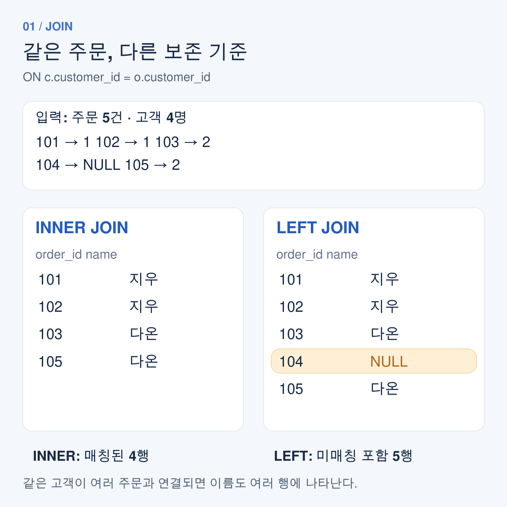
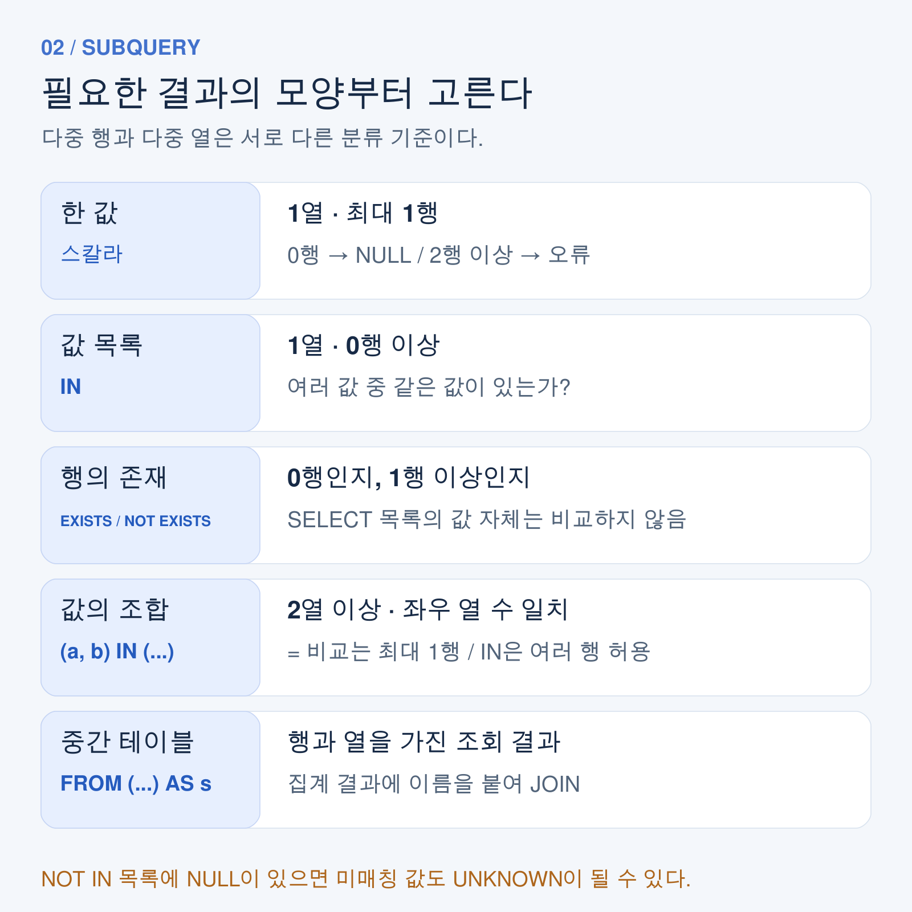
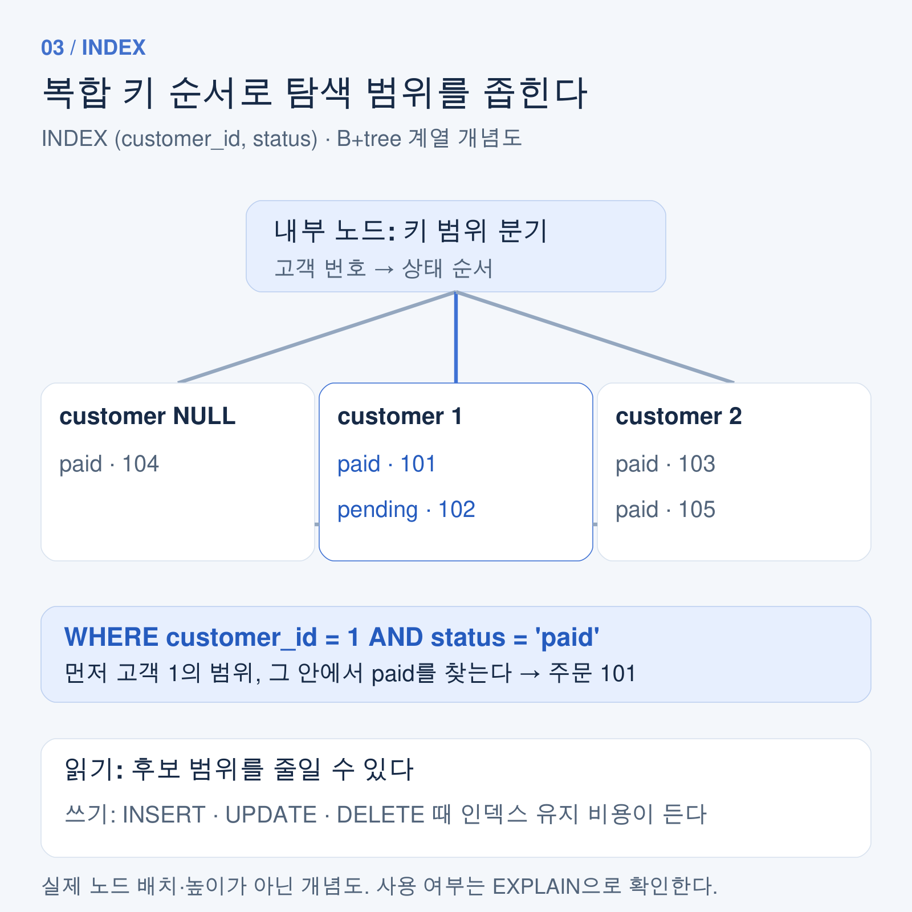

# SQL 고급: JOIN·서브쿼리·인덱스·VIEW를 하나의 예제로 이해하기

테이블을 나누어 저장하면 중복은 줄어들지만, 조회할 때는 다시 연결해야 한다. 또 “평균보다 큰 주문”이나 “주문이 없는 고객”처럼 다른 조회 결과를 조건으로 쓰는 순간에는 단순한 `WHERE`만으로 부족하다.

이 글에서는 고객과 주문을 예제로 JOIN, 서브쿼리, 인덱스, VIEW를 연결한다. **JOIN은 어떤 행을 남길지, 서브쿼리는 어떤 형태의 결과를 비교할지, 인덱스는 어떤 탐색 비용을 줄일지**를 결정한다. 문법은 MySQL 8.4를 기준으로 설명한다.

## 1. 고객과 주문을 분리하는 이유

주문마다 고객 이름을 저장하면 고객 이름이 바뀔 때 여러 행을 수정해야 한다. 고객 정보는 `customers`에 두고, 주문은 `customer_id`로 고객을 참조하도록 설계하면 수정 지점을 줄일 수 있다.

이번 글에서 사용하는 데이터는 다음과 같다. `amount`는 정수 금액이며 `NULL`을 허용하지 않는다.

**customers**

| customer_id | name | region | referrer_id |
|---|---|---|---|
| 1 | 지우 | 서울 | NULL |
| 2 | 다온 | 부산 | 1 |
| 3 | 서윤 | 서울 | 1 |
| 4 | 하람 | 대전 | 2 |

**orders**

| order_id | customer_id | amount | status |
|---|---|---|---|
| 101 | 1 | 30000 | paid |
| 102 | 1 | 70000 | pending |
| 103 | 2 | 50000 | paid |
| 104 | NULL | 40000 | paid |
| 105 | 2 | 50000 | paid |

`customer_id`가 `NULL`인 104번은 회원과 연결되지 않은 비회원 주문이다. 외래키가 있더라도 열이 NULL을 허용하면 이런 행을 저장할 수 있다. 외래키는 참조 무결성을 검사하고, JOIN은 지정한 조건으로 행을 결합한다. JOIN을 쓰기 위해 외래키 선언이 반드시 필요한 것은 아니다.

## 2. INNER JOIN과 LEFT JOIN: 무엇을 남길 것인가

### INNER JOIN은 조건에 맞는 행 조합을 남긴다

```sql
SELECT o.order_id, c.name, o.amount
FROM orders AS o
INNER JOIN customers AS c
  ON c.customer_id = o.customer_id
ORDER BY o.order_id;
```

결과는 다음과 같다.

| order_id | name | amount |
|---|---|---|
| 101 | 지우 | 30000 |
| 102 | 지우 | 70000 |
| 103 | 다온 | 50000 |
| 105 | 다온 | 50000 |

104번 주문은 연결할 고객이 없어 제외된다. 지우가 두 번 나오는 이유는 주문 두 개가 각각 같은 고객과 매칭되기 때문이다. **JOIN의 결과 행 수는 테이블 행 수뿐 아니라 매칭되는 조합의 수에 따라 달라진다.** 조인 키가 양쪽에서 중복된다면 같은 키의 행들이 서로 여러 조합을 만들 수 있다.

### LEFT JOIN은 왼쪽 행을 보존한다

```sql
SELECT o.order_id, c.name, o.amount
FROM orders AS o
LEFT JOIN customers AS c
  ON c.customer_id = o.customer_id
ORDER BY o.order_id;
```

여기서는 104번도 남고 고객 이름만 `NULL`이 된다. “회원 주문만”인지 “비회원 주문을 포함한 모든 주문”인지에 따라 JOIN 종류가 달라진다.



*JOIN은 겹치는 영역보다 실제 행 조합과 미매칭 행을 보면 이해하기 쉽다.*

### 주문이 없는 고객은 고객을 왼쪽에 둔다

```sql
SELECT c.customer_id, c.name
FROM customers AS c
LEFT JOIN orders AS o
  ON o.customer_id = c.customer_id
WHERE o.order_id IS NULL
ORDER BY c.customer_id;
```

결과는 `3, 서윤`과 `4, 하람`이다. 이때 검사할 열은 원래 NULL이 될 수 없는 오른쪽의 기본키가 적절하다. 원래부터 NULL을 허용하는 열을 검사하면 “매칭 실패”와 “매칭된 행의 값이 NULL”을 혼동할 수 있다.

`customers LEFT JOIN orders`와 `orders RIGHT JOIN customers`는 같은 매칭 조건과 명시적인 출력 열을 사용하면 같은 고객 보존 결과를 표현할 수 있다. `SELECT *`의 열 순서는 달라질 수 있다. 읽기 쉽게 보존할 테이블을 왼쪽에 두는 방식으로 통일해도 된다. [MySQL JOIN 문서](https://dev.mysql.com/doc/refman/8.4/en/join.html)

## 3. LEFT JOIN에서 ON과 WHERE를 구분한다

모든 고객을 남기면서 결제 완료 주문만 연결하려면 주문 조건을 `ON`에 넣는다.

```sql
SELECT c.customer_id, c.name, o.order_id
FROM customers AS c
LEFT JOIN orders AS o
  ON o.customer_id = c.customer_id
 AND o.status = 'paid'
ORDER BY c.customer_id, o.order_id;
```

이 쿼리는 고객 4명을 모두 보존한다. 지우는 101번, 다온은 103·105번 주문과 연결되고 서윤·하람은 주문 열이 NULL인 행으로 남는다. 결과는 총 5행이다.

반대로 아래 쿼리는 조인 결과에서 결제 완료 행만 남긴다.

```sql
SELECT c.customer_id, c.name, o.order_id
FROM customers AS c
LEFT JOIN orders AS o
  ON o.customer_id = c.customer_id
WHERE o.status = 'paid'
ORDER BY c.customer_id, o.order_id;
```

미매칭 고객의 `o.status`는 NULL이고, `NULL = 'paid'`는 참이 아니다. 따라서 서윤과 하람은 제거되어 총 3행이 남는다. 조건을 어디에 쓰는지는 단순한 문체 차이가 아니라 결과의 의미를 바꾼다.

고객별 주문 수를 세는 경우에도 NULL 보충 행에 주의해야 한다.

```sql
SELECT c.customer_id, c.name, COUNT(o.order_id) AS order_count
FROM customers AS c
LEFT JOIN orders AS o
  ON o.customer_id = c.customer_id
GROUP BY c.customer_id, c.name
ORDER BY c.customer_id;
```

주문 수는 각각 `2, 2, 0, 0`이다. `COUNT(*)`는 미매칭 고객에게 생성된 행도 세기 때문에 주문이 없는 고객에게 1을 반환한다. `COUNT(o.order_id)`는 NULL을 제외한다.

## 4. SELF JOIN: 같은 테이블을 서로 다른 역할로 읽는다

SELF JOIN은 별도의 `SELF JOIN` 키워드가 아니다. 같은 테이블을 다른 별칭으로 참조하는 방식이다.

```sql
SELECT c.name AS customer_name, r.name AS referrer_name
FROM customers AS c
LEFT JOIN customers AS r
  ON r.customer_id = c.referrer_id
ORDER BY c.customer_id;
```

`c`는 고객, `r`은 추천인 역할이다. 지우의 추천인은 NULL, 다온·서윤의 추천인은 지우, 하람의 추천인은 다온으로 조회된다.

같은 추천인이 있는 고객 쌍을 한 번씩만 보고 싶다면 다음처럼 쓴다.

```sql
SELECT a.name AS customer_a, b.name AS customer_b
FROM customers AS a
INNER JOIN customers AS b
  ON a.referrer_id = b.referrer_id
 AND a.customer_id < b.customer_id;
```

결과는 `다온, 서윤` 한 쌍이다. `<` 조건은 자기 자신과의 매칭을 막고 `(다온, 서윤)`과 `(서윤, 다온)`이 중복되는 것도 막는다. 일반적인 `=` 비교에서는 NULL 추천인끼리 매칭되지 않는다.

## 5. 서브쿼리는 반환 결과의 모양부터 확인한다

서브쿼리는 SQL 문 안에 들어가는 또 다른 조회문이다. 위치만 외우기보다 **열이 몇 개인지, 행이 몇 개까지 나오는지, 값·목록·행의 존재 중 무엇이 필요한지**를 먼저 판단하면 연산자를 고르기 쉽다.



*반환하는 행 수와 열 수가 서브쿼리 사용 방식을 결정한다.*

### 스칼라 서브쿼리: 한 값을 비교한다

```sql
SELECT order_id, amount
FROM orders
WHERE amount > (SELECT AVG(amount) FROM orders)
ORDER BY order_id;
```

다섯 주문의 평균은 48000이다. 따라서 102·103·105번 주문이 조회된다.

스칼라 서브쿼리는 **한 열에서 최대 한 행**을 반환해야 한다. 0행이면 값은 NULL, 2행 이상이면 MySQL에서 오류가 난다. 집계만 있고 `GROUP BY`가 없는 `AVG` 쿼리는 입력이 비어도 한 행을 반환하며 평균값이 NULL이다. 이 차이도 구분해야 한다.

### IN: 여러 행의 값 목록과 비교한다

```sql
SELECT order_id, amount
FROM orders
WHERE customer_id IN (
  SELECT customer_id
  FROM customers
  WHERE region = '서울'
)
ORDER BY order_id;
```

서울 고객 번호는 1과 3이므로 결과는 101·102번이다. 여러 고객 번호가 나올 수 있는 자리에 단순한 `=`를 쓰면 스칼라 서브쿼리의 행 수 제한에 걸린다.

### EXISTS와 NOT EXISTS: 행이 있는지를 묻는다

```sql
SELECT c.customer_id, c.name
FROM customers AS c
WHERE NOT EXISTS (
  SELECT 1
  FROM orders AS o
  WHERE o.customer_id = c.customer_id
)
ORDER BY c.customer_id;
```

결과는 서윤·하람이다. `SELECT 1`의 숫자를 비교하는 것이 아니라 조건에 맞는 행이 존재하는지를 검사한다. 바깥 고객 번호를 안쪽 조건에서 사용하므로 상관 서브쿼리다. 이것은 논리적인 의존 관계이며 실제 물리 실행을 반드시 “고객마다 한 번씩 재실행”한다고 단정할 수는 없다.

다음 쿼리는 같은 의미로 쓰기 어렵다.

```sql
SELECT customer_id, name
FROM customers
WHERE customer_id NOT IN (SELECT customer_id FROM orders);
```

목록에 NULL이 포함되어 있어, 주문이 없는 3·4번도 조건이 UNKNOWN이 된다. 이 데이터에서는 아무 고객도 반환하지 않는다. 필요하다면 안쪽에서 `WHERE customer_id IS NOT NULL`로 NULL을 제외할 수 있지만, “연결된 주문이 없다”는 질문은 `NOT EXISTS`로 표현하면 의도가 분명하다.

### ANY와 ALL: 일부 또는 모든 값과 비교한다

`amount > ANY (...)`는 목록 중 하나 이상보다 큰지, `amount > ALL (...)`는 모든 값보다 큰지를 묻는다. 비어 있지 않고 NULL이 없는 `{30000, 50000}` 목록이라면 40000은 `> ANY`를 만족하지만 `> ALL`은 만족하지 않는다.

빈 결과에서는 `ANY`가 거짓, `ALL`이 참이다. NULL이 포함되면 비교 결과가 UNKNOWN이 될 수도 있으므로 무조건 `MIN`·`MAX`와 같은 의미라고 치환하면 안 된다. [MySQL ANY 문서](https://dev.mysql.com/doc/refman/8.4/en/any-in-some-subqueries.html), [ALL 문서](https://dev.mysql.com/doc/refman/8.4/en/all-subqueries.html)

## 6. 다중 열과 FROM 서브쿼리로 집계 결과를 연결한다

### 다중 열 비교는 값의 조합을 검사한다

고객별 가장 큰 금액의 주문을 조회해 보자.

```sql
SELECT order_id, customer_id, amount
FROM orders
WHERE (customer_id, amount) IN (
  SELECT customer_id, MAX(amount)
  FROM orders
  WHERE customer_id IS NOT NULL
  GROUP BY customer_id
)
ORDER BY order_id;
```

결과는 102·103·105번이다. `(고객 번호, 최대 금액)`이라는 조합을 비교하므로 다른 고객의 최대 금액에 우연히 같은 금액인 주문을 잘못 포함하지 않는다. 다온의 103·105번은 같은 최대 금액이므로 둘 다 남는다. **최대값을 찾는 쿼리는 공동 최대값을 모두 반환할 수 있다.** 한 건만 원한다면 동률을 깨는 기준을 별도로 정해야 한다.

행 비교의 좌우 열 수는 같아야 한다. `(a, b) = (서브쿼리)`에는 최대 한 행, `(a, b) IN (서브쿼리)`에는 여러 행을 사용할 수 있다. 다중 열과 다중 행은 서로 다른 분류 기준이다.

### FROM 서브쿼리는 중간 테이블을 만든다

```sql
SELECT c.name, s.total_amount
FROM customers AS c
INNER JOIN (
  SELECT customer_id, SUM(amount) AS total_amount
  FROM orders
  WHERE customer_id IS NOT NULL
  GROUP BY customer_id
) AS s
  ON s.customer_id = c.customer_id
WHERE s.total_amount >= 100000
ORDER BY c.customer_id;
```

결과는 지우와 다온이며 둘 다 100000이다. 안쪽에서 고객별 합계를 만든 뒤 바깥에서 이름을 붙인다. MySQL의 FROM 서브쿼리에는 테이블 별칭이 필요하다. 여기서 `s`가 그 별칭이다. 중간 결과가 반드시 디스크나 메모리에 별도 테이블로 저장된다는 뜻은 아니며 옵티마이저가 실행 방식을 결정한다. [MySQL 서브쿼리 문서](https://dev.mysql.com/doc/refman/8.4/en/subqueries.html)

## 7. 인덱스는 조회 조건에 맞는 탐색 경로다

인덱스는 값을 찾기 위한 별도 자료구조다. 모든 행을 훑는 작업을 줄이는 데 도움이 되지만 저장 공간과 데이터 변경 시 갱신 비용이 든다. 읽기를 빠르게 하려고 인덱스를 무작정 늘리면 쓰기 작업의 부담이 커질 수 있다.

### 생성·조회·삭제 문법

```sql
-- 테이블을 만들 때도 정의할 수 있다.
CREATE TABLE products (
  product_id INT PRIMARY KEY AUTO_INCREMENT,
  name VARCHAR(100) NOT NULL,
  INDEX idx_products_name (name)
);

-- 이미 있는 테이블에 추가한다.
CREATE INDEX idx_orders_customer_status
ON orders (customer_id, status);

-- ALTER TABLE로 추가할 수도 있다.
ALTER TABLE customers ADD INDEX idx_customers_region (region);

SHOW INDEX FROM orders;
SHOW CREATE TABLE orders;

-- 삭제할 때 테이블도 지정한다.
DROP INDEX idx_customers_region ON customers;
-- 같은 삭제 목적의 다른 문법: ALTER TABLE customers DROP INDEX idx_customers_region;
```

`INDEX`와 `KEY`는 테이블 정의 안에서 같은 일반 인덱스 의미로 사용할 수 있다. 일반 인덱스는 중복을 허용한다. `UNIQUE` 인덱스는 중복을 제한하지만 MySQL에서는 NULL을 허용하는 열에 여러 NULL을 저장할 수 있다. 기본키는 고유성과 NOT NULL을 함께 요구한다. [MySQL CREATE INDEX 문서](https://dev.mysql.com/doc/refman/8.4/en/create-index.html)

### 복합 인덱스는 열 순서가 중요하다

`(customer_id, status)` 인덱스는 고객 번호를 먼저, 같은 고객 안에서는 상태를 다음 기준으로 정렬한 구조로 이해할 수 있다.

```sql
SELECT order_id, amount
FROM orders
WHERE customer_id = 1 AND status = 'paid';
```

`customer_id`만 사용하는 조건도 왼쪽부터 시작하는 인덱스 접두부에 해당한다. 반면 `status`만 검색하는 조건은 같은 방식으로 탐색 범위를 좁힐 수 없다. 다만 옵티마이저가 다른 접근법을 고를 수 있으므로 “인덱스를 절대 못 쓴다”라고 단정하지 않는다. [MySQL 복합 인덱스 문서](https://dev.mysql.com/doc/refman/8.4/en/multiple-column-indexes.html)

인덱스 선택은 실제 조회 패턴, 조건에 해당하는 행의 비율, 정렬·조인 조건을 함께 보고 결정한다. 데이터가 작거나 대부분의 행을 읽는 쿼리는 전체 스캔이 더 합리적일 수도 있다.

### B-tree 계열 구조와 실행계획

B-tree는 한 노드에 여러 키와 자식 경로를 두는 균형 다진 탐색 구조다. 트리 높이를 낮게 유지해 탐색에 필요한 단계와 페이지 접근을 줄인다. InnoDB의 일반 인덱스는 B+tree 계열 구조로 이해하면 좋다. 리프에서 정렬된 키를 따라가므로 범위 탐색에도 유리하다.



*실제 페이지 배치를 재현한 그림이 아니라 복합 키 순서와 탐색 경로를 보여 주는 개념도다.*

단순화한 탐색 모델에서 한 키 찾기는 `O(log N)`, 범위 결과 k개를 순회하는 작업은 `O(log N + k)` 수준으로 설명할 수 있다. 실제 SQL 비용에는 페이지 I/O, 캐시, 행 조회, 추가 필터링이 함께 영향을 준다.

```sql
EXPLAIN
SELECT order_id, amount
FROM orders
WHERE customer_id = 1 AND status = 'paid';
```

인덱스가 있다고 반드시 사용되는 것은 아니다. `EXPLAIN`의 `possible_keys`는 후보이고 `key`는 선택된 인덱스다. `rows`는 예상 행 수이므로 실제 처리 행 수나 실행 시간으로 읽지 않는다. 이 글에서는 MySQL 실행계획이나 성능 수치를 실측하지 않았다. [MySQL 인덱스 문서](https://dev.mysql.com/doc/refman/8.4/en/mysql-indexes.html)

## 8. VIEW는 반복되는 조회 정의를 저장한다

VIEW는 조회 결과를 영구 복사해 두는 테이블이 아니라 쿼리 정의를 저장하는 가상 테이블이다.

```sql
CREATE VIEW v_customer_order_totals AS
SELECT c.customer_id, c.name,
       COUNT(o.order_id) AS order_count,
       COALESCE(SUM(o.amount), 0) AS total_amount
FROM customers AS c
LEFT JOIN orders AS o
  ON o.customer_id = c.customer_id
GROUP BY c.customer_id, c.name;

SELECT name, total_amount
FROM v_customer_order_totals
WHERE total_amount >= 100000
ORDER BY customer_id;

-- 필요 없어진 뷰를 삭제할 때 사용한다.
-- DROP VIEW v_customer_order_totals;
```

`COALESCE`는 주문이 없는 고객의 합계 NULL을 0으로 바꾼다. VIEW를 쓰면 같은 조인·집계를 매번 다시 작성하지 않고 이름으로 참조할 수 있다. 정렬이 필요하면 뷰를 조회하는 바깥 쿼리에 `ORDER BY`를 지정한다.

`v_`는 이름을 알아보기 위한 관례이며 필수 문법은 아니다. VIEW가 실행될 때 내부적으로 쿼리를 병합하거나 중간 결과를 구체화할 수 있으므로, VIEW를 만들었다는 이유만으로 성능 개선을 보장할 수 없다. 이 집계 뷰는 직접 갱신할 수 있는 뷰도 아니다. 접근 범위 제한에 활용할 때는 기본 테이블 권한과 뷰의 보안 설정까지 함께 설계해야 한다. [MySQL CREATE VIEW 문서](https://dev.mysql.com/doc/refman/8.4/en/create-view.html)

## 9. 쿼리를 작성할 때 확인할 질문

| 질문 | 확인할 기준 |
|---|---|
| 매칭되지 않은 행도 남겨야 하는가? | INNER JOIN과 OUTER JOIN 선택 |
| 보존할 행과 매칭 조건을 구분했는가? | LEFT JOIN의 ON·WHERE 위치 |
| 행이 예상보다 늘어났는가? | 조인 키 중복과 매칭 조합 수 |
| 한 값, 목록, 존재 여부 중 무엇이 필요한가? | 스칼라·IN·EXISTS 선택 |
| NULL이나 공동 최대값이 있는가? | NOT IN과 다중 열 비교의 경계 조건 |
| 자주 쓰는 조건에 맞는 인덱스인가? | 열 순서와 실행계획 |
| 같은 조회 정의를 반복하는가? | VIEW를 통한 재사용 |

결과에 남아야 할 행을 먼저 정하고, 비교할 결과의 형태를 확인한 뒤, 실제 실행계획으로 탐색 비용을 점검하면 복잡한 SQL도 단계별로 설명할 수 있다.

> 예제의 JOIN·집계·IN·NOT EXISTS·다중 열 비교 결과는 자동화 도구로 SQLite 메모리 데이터베이스에서 재현했다. MySQL 8.4 전용 DDL, ANY·ALL, 스칼라 다중 행 오류, 실행계획은 MySQL 공식 문서로 확인했으며 MySQL 서버에서 직접 실행하지 않았다.

## 그림 원본

편집 가능한 SVG: [JOIN 결과](img/sql-join-results.svg) · [서브쿼리 반환 형태](img/sql-subquery-shapes.svg) · [인덱스 탐색](img/sql-index-path.svg)
