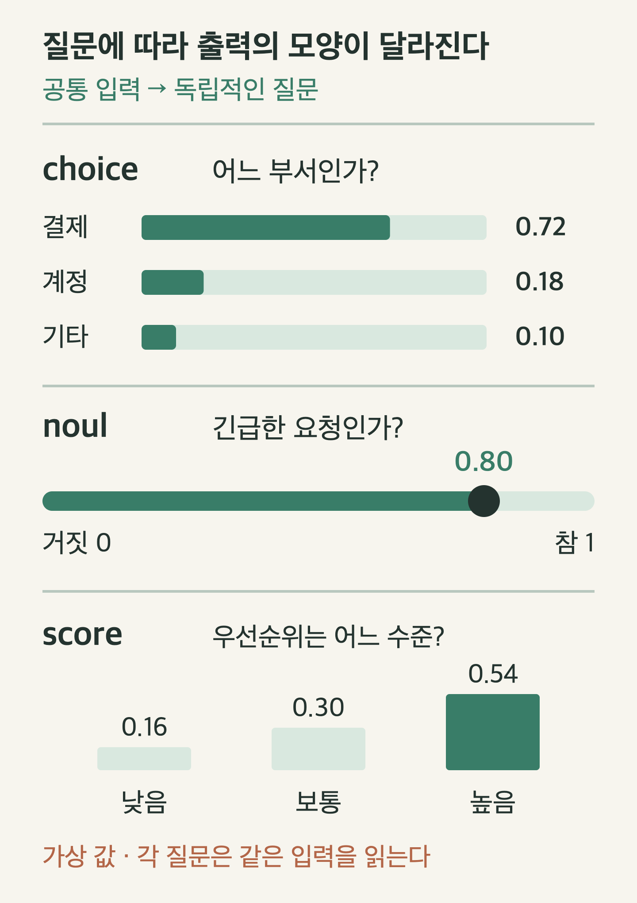
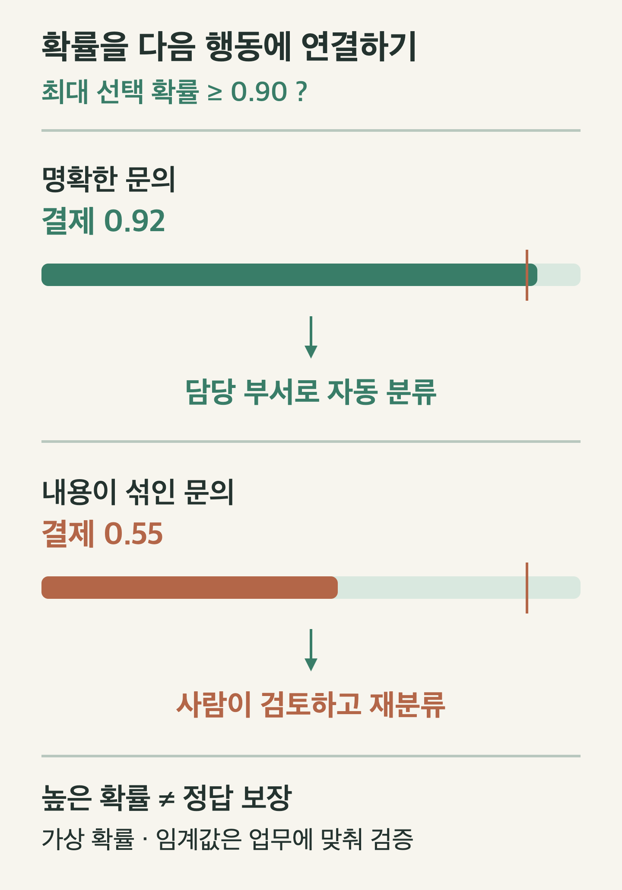

# JEV와 KEV 이해하기: 글을 생성하는 AI에서 결정을 내리는 AI로

고객 문의를 담당 부서로 보내려면 긴 답변보다 ‘결제·계정·기술·기타 중 어디인가’라는 판단이 필요하다. JEV와 KEV는 이런 **정해진 질문에 대한 결정**을 모델의 중심 출력으로 다룬다.

이 글은 2026년 10월 1일 공식 문서와 공개 저장소를 확인해 정리했다. 아래 입력과 확률 예시는 설명용이며, 모델을 호출하거나 성능을 측정한 결과는 아니다.

## 1. JEV와 KEV는 어떤 관계인가?

**Jev**는 TypeSafe가 제공하는 System One 모델이다. 자연어 상태를 읽고 정해진 형식의 결정과 확률을 반환한다. 자유로운 문장 작성이나 코드 생성에 쓰는 모델과 목적이 다르다. [TypeSafe System One](https://docs.typesafe.ai/concepts/system-one)

**Kev**는 Jared Palmer가 공개한 별도의 모델 계열이다. TypeSafe의 System One API와 호환되는 인터페이스를 제공하고, 공개 기반 모델에 어댑터와 결정용 출력을 구성한다. TypeSafe가 공개한 Jev 가중치가 아니며, 두 이름을 같은 모델의 상용·무료 버전으로 이해하면 안 된다. [Kev 저장소](https://github.com/jaredpalmer/kev)

| 비교 기준 | Jev | Kev |
|---|---|---|
| 제공 주체 | TypeSafe | Jared Palmer의 공개 프로젝트 |
| 실행 방식 | TypeSafe 호스팅 API | 직접 모델·서버 구성 가능 |
| 모델 계열 | TypeSafe의 결정 모델 | 공개 기반 모델에 어댑터·결정 헤드 구성 |
| 핵심 검토 | API 조건, 품질, 제공 범위 | 모델 크기, 장비, 운영과 품질 |

인터페이스가 비슷하면 입력 구조를 공유하기 쉽다. 그러나 출력 품질, 확률의 보정, 처리량까지 동일해지는 것은 아니다.

## 2. System One: 답변 문장보다 판단 결과

System One이라는 이름은 빠른 판단과 숙고를 구분하는 사고 체계에서 영감을 얻은 것이다. 인간의 뇌를 그대로 구현했다는 주장으로 해석할 필요는 없다. 문서에서는 좁은 질문을 조합해 업무 흐름을 구성하는 방식을 설명한다. [개념 문서](https://docs.typesafe.ai/concepts/system-one)

고객 문의라면 다음 두 작업을 구분할 수 있다.

- **결정:** 어떤 담당 부서로 보낼까? 사람이 확인해야 할까?
- **생성:** 고객에게 어떤 문장으로 설명할까?

분류 결과만 필요한 단계에서는 장문의 답변을 생성하고 다시 문자열로 분석하는 과정이 불필요할 수 있다. 반대로 정책 설명이나 답장 작성은 문장 생성 능력이 필요하다. 두 모델 종류를 연결한다면 결정 결과로 다음 단계를 고르고, 생성 모델이 필요한 설명을 작성하는 구성이 가능하다.

## 3. choice·noul·score: 세 종류의 질문

TypeSafe의 핵심 질문 형식은 세 가지다. [Primitives 문서](https://docs.typesafe.ai/primitives)

| 형식 | 묻는 것 | 출력에서 읽을 것 |
|---|---|---|
| `choice` | 제시한 선택지 중 무엇인가? | 선택 결과와 선택지별 확률·confidence |
| `noul` | 이 명제가 참인가? | 참일 확률인 0에서 1 사이의 값 |
| `score` | 순서가 있는 수준 중 어디인가? | 수준별 확률과 점수·confidence |



*세 출력 형식의 모양을 설명하기 위한 가상 값이다. noul에는 별도의 confidence 필드가 없다.*

`choice`에서 ‘기타’나 ‘판단 불가’가 필요하다면 처음부터 선택지에 넣어야 한다. 현실의 입력이 모든 선택지 밖에 있을 수 있기 때문이다. 선택지를 네 개로 제한해도 반드시 올바른 부서가 그 안에 있다는 보장은 없다.

`noul`의 0.8은 명제가 참일 확률에 관한 값이다. ‘자신감 점수 0.8’과 혼용하지 않는다. `score`도 항상 정수로 떨어지는 등급표라고 생각하면 안 된다. API 설명에서는 수준별 확률을 반영해 점수를 계산하므로 중간 값이 나올 수 있다. [API 출력 정의](https://docs.typesafe.ai/api)

## 4. state와 questions를 어떻게 설계할까?

`state`에는 판단에 필요한 사실과 맥락을 넣고, `questions`에는 판단할 기준을 넣는다. state는 문자열·객체·배열 등 텍스트 정보를 사용할 수 있다. 현재 TypeSafe 문서는 이미지·오디오·비디오 입력을 지원하지 않으며 영어 중심이라고 설명한다. 한글 데이터의 품질을 영어 평가에서 그대로 추정해서는 안 된다. [State 문서](https://docs.typesafe.ai/concepts/state)

아래는 직접 구성한 요청 본문 예시다. TypeSafe API의 `POST /v1/systemone` 형식을 따른다. 실제 요청에는 인증도 필요하다. [API 문서](https://docs.typesafe.ai/api)

```json
{
  "model": "jev-latest",
  "state": {
    "message": "I was charged twice for the same subscription.",
    "policy": "Billing handles charges and refunds. Account handles access."
  },
  "questions": {
    "route": {
      "type": "choice",
      "instructions": "Choose the team responsible for this customer message.",
      "criteria": {
        "billing": "Charges, invoices, or refunds",
        "account": "Login or account access",
        "technical": "Product errors or malfunctions",
        "other": "Outside these categories or insufficient information"
      }
    }
  }
}
```

질문 ID인 `route`만으로 의미를 전달하려고 하면 안 된다. TypeSafe는 질문 ID가 모델 입력이 아니라고 설명하므로, 판단 지시는 `instructions`에 명시한다. 또한 한 요청에 넣은 질문들은 같은 상태를 바탕으로 독립적으로 판단한다. 첫 질문의 답을 두 번째 질문이 자동으로 읽는 구조가 아니다. [질문 작성 규칙](https://docs.typesafe.ai/primitives)

예를 들어 ‘분류 결과가 billing이면 환불 여부를 판단하라’는 순차 의존성이 있다면 애플리케이션이 첫 결과를 받고 다음 요청을 구성해야 한다. 한 번에 두 질문을 넣는 것만으로 조건부 실행이 완성되지는 않는다.

## 5. 확률과 confidence를 정확도로 읽지 않기

선택지별 확률은 판단이 어디에 모이는지 보여 준다. confidence는 분포에서 계산되는 요약 값이다. 두 값은 구분해서 읽어야 한다. 높은 confidence만으로 개별 판단의 정답을 보장할 수 없다. [Confidence 문서](https://docs.typesafe.ai/confidence)

다음은 **최대 선택 확률을 기준으로 분기하는 가상의 운영 예시**다. 아래 값은 confidence 필드가 아니다.

| 입력 사례 | 가장 높은 선택 확률 | 예시 처리 |
|---|---|---|
| 중복 결제가 명확한 문의 | billing 0.92 | 담당 부서 분류 자동 적용 |
| 결제와 로그인 문제가 섞인 문의 | billing 0.55 | 사람에게 검토 요청 |



*임계값 0.90은 설명용 설정이다. 실제 서비스의 보편적인 권장값이나 모델 성능 수치가 아니다.*

확률이 보정됐다는 말은 비슷한 확률을 받은 여러 사례의 실제 정답 비율과 예측이 맞는지를 뜻한다. 한 사례의 확률이 높다고 반드시 맞는다는 뜻은 아니다. 서비스에서는 대표 데이터와 정답을 모아 자동 처리한 비율, 그중 오분류 비율, 사람이 확인한 비율을 함께 봐야 한다. [확률 보정의 의미](https://docs.typesafe.ai/concepts/system-one)

문의 부서 분류와 결제 승인에는 다른 기준이 필요하다. 잘못 분류한 문의는 다시 배정할 수 있지만 잘못 승인한 결제는 비용을 만들 수 있다. 임계값은 업무의 손실과 검토 비용에 맞춰 정해야 한다.

## 6. KEV는 어떻게 결정을 출력할까?

Kev-4B 모델 카드에서는 Qwen3.5-4B-Base를 기반으로 LoRA 어댑터와 pointer head를 구성했다고 설명한다. 후보에 대한 점수를 확률 분포로 바꾸는 방식으로, 질문마다 자유로운 설명 문장을 생성하는 것이 중심 동작은 아니다. [Kev-4B 모델 카드](https://github.com/jaredpalmer/kev/blob/main/docs/model-cards/kev-4b.md)

공개된 학습·구조를 볼 수 있다는 장점은 있지만, Jev의 학습 방법을 그대로 재현했다고 단정할 근거는 없다. TypeSafe가 소개한 RLCD는 결정의 보정과 관련된 학습 접근이다. Kev의 공개 구현과 그 명칭을 동일시하면 안 된다. [Jev와 RLCD 소개](https://typesafe.ai/blog/introducing-system-one-models-and-jev)

자체 운영에는 모델 크기 외에 장비 메모리, 동시 요청, 캐시, 장애 대응이 필요하다. 공개 가중치가 있다는 것은 운영 비용이 없다는 뜻이 아니다. 코드·가중치의 라이선스와 기반 모델·학습 데이터에 적용되는 조건도 각각 확인해야 한다. [Kev 저장소와 라이선스](https://github.com/jaredpalmer/kev)

## 7. 어느 쪽을 선택해야 할까?

Jev API를 검토한다면 실제 언어와 업무 분포에서 품질을 먼저 확인하고 비용을 계산한다. 확인 시점의 공식 문서는 `jev-latest`가 Jev 1.13.0을 가리키며 입력 100만 토큰당 $0.042, 출력 무료라고 안내한다. 별칭은 바뀔 수 있으므로 평가 결과에는 정확한 버전도 남기는 편이 좋다. [모델·가격 문서](https://docs.typesafe.ai/models)

Kev를 검토한다면 같은 데이터와 질문으로 평가하고 운영 부담까지 포함해 비교한다. 두 모델의 수치를 나란히 놓으려면 데이터 분할, 질문 문구, 선택지, 모델 버전이 같아야 한다. Kev 저장소의 한 평가에서는 Jev의 dev 결과와 Kev의 test 결과가 함께 제시되므로 서로 다른 분할의 점수를 곧바로 우열 비교에 쓰면 안 된다. [평가 기록](https://github.com/jaredpalmer/kev)

검증용 데이터에는 명확한 사례뿐 아니라 복합 문의, 선택지 밖의 문의, 짧은 문장, 한글·영어 혼합 입력을 포함할 수 있다. ‘기타’ 선택지가 실제로 작동하는지, 자동 처리 임계값을 높였을 때 오분류와 검토량이 어떻게 바뀌는지 확인하면 모델 선택에 도움이 된다.

JEV·KEV는 **정해진 형식의 답**을 얻는 수단이다. 판단의 정확성은 입력 맥락, 선택지 설계, 모델 품질, 실제 업무 데이터의 검증으로 확인해야 한다. 분류 결과가 다음 행동으로 이어지는 시스템에서는 출력 형식만큼 검토와 예외 처리의 설계가 중요하다.


---

편집 가능한 그림 원본: [decision-primitives.svg](img/decision-primitives.svg), [decision-routing.svg](img/decision-routing.svg)
