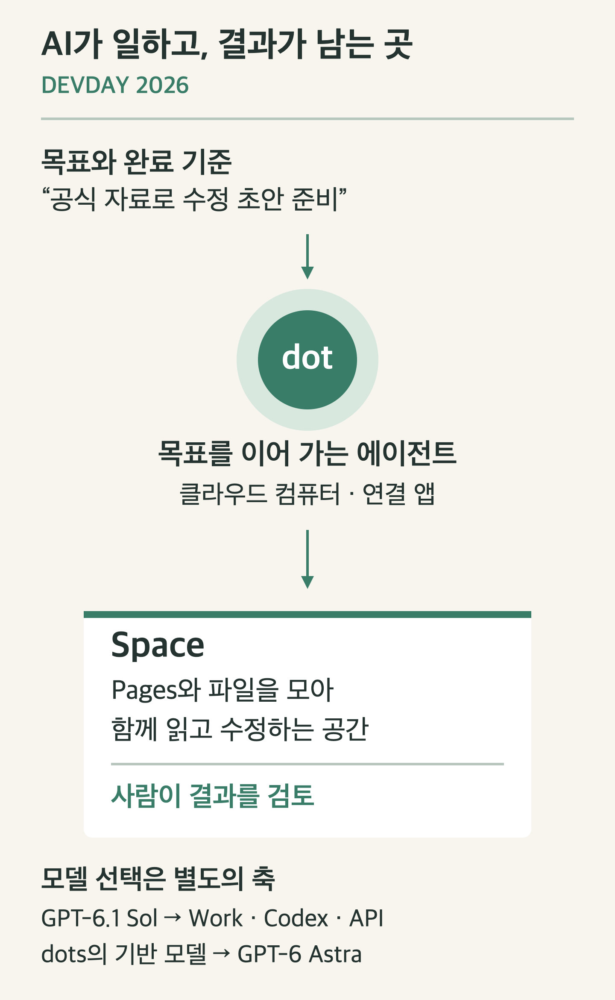

# OpenAI DevDay 2026 정리: GPT-6.1 Sol, dots, Space는 무엇을 바꾸나

OpenAI DevDay 2026에서 눈에 띈 변화는 모델 성능뿐 아니라 AI가 일하는 환경이다. GPT-6.1 Sol은 실행 비용을, dots는 지속적인 업무를, Space는 결과물의 공유와 편집을 다룬다. 이 세 가지를 역할별로 이해하면 발표 목록을 외우는 것보다 실제 활용 방법이 선명해진다.

이 글은 **2026년 10월 1일 공식 발표·문서 확인 기준**이다. 직접 사용한 후기나 성능 실측은 포함하지 않는다.

## 1. 한국시간 9월 30일 새벽 2시, DevDay에서 발표한 것

공식 행사명은 **OpenAI DevDay 2026**이다. 샌프란시스코에서 9월 29일 오전 10시에 시작한 키노트는 한국시간으로 9월 30일 오전 2시다. 당시 샌프란시스코는 서머타임을 적용해 한국과 16시간 차이가 난다. [공식 행사 일정](https://devday.openai.com/)

발표 내용을 다음 세 질문으로 나눠 보자.

| 질문 | 관련 발표 | 의미 |
|---|---|---|
| 어떤 모델로 실행할까? | GPT-6.1 Sol, Ultrafast | 능력·비용·응답 속도의 선택 |
| 누가 계속 일을 이어 갈까? | dots, 클라우드 작업 환경 | 목표와 실행을 대화 사이에도 이어 가기 |
| 결과를 어디에 모을까? | Space, Pages | 문서·파일을 함께 검토하고 편집하기 |

이 구분은 제품의 공식 계층도가 아니라 발표를 읽기 위한 관점이다. 특히 **dots는 GPT-6 Astra로 구동된다. 새로 발표된 Sol이 dots의 기반 모델이라는 뜻은 아니다.** [dots 발표](https://openai.com/index/introducing-dots/)

*지속적인 실행과 공동 검토의 관계. 실제 제품 화면이나 필수 실행 경로를 나타내지는 않는다.*

## 2. GPT-6.1 Sol: 반복적인 작업의 비용을 낮추는 모델

OpenAI는 GPT-6.1 Sol을 코딩·컴퓨터 사용·전문 업무에서 Astra에 가까운 능력을 제공하면서 표준 입출력 토큰 가격을 낮춘 모델로 소개했다. 여기서 ‘Astra에 가깝다’는 표현은 발표자가 제시한 평가에 관한 설명이다. 모든 분야에서 동일한 성능을 보장한다는 뜻으로 받아들이면 안 된다. [GPT-6.1 Sol 발표](https://openai.com/index/introducing-gpt-6-1-sol/)

API의 기본 가격과 명칭은 다음과 같다.

| 항목 | GPT-6.1 Sol |
|---|---|
| API 모델 ID | `gpt-6.1-sol` |
| 입력 토큰 | 100만 토큰당 $2 |
| 캐시된 입력 토큰 | 100만 토큰당 $0.10 |
| 출력 토큰 | 100만 토큰당 $10 |

이는 기본 표준 요율이다. 장문 입력·처리 등급·지역 설정 등에 따른 추가 조건은 별도로 확인해야 한다. [공식 모델 문서](https://developers.openai.com/api/docs/models/gpt-6.1-sol)

예를 들어 캐시를 사용하지 않고 입력 10만 토큰, 출력 1만 토큰을 처리했다면 기본 토큰 비용은 `$0.20 + $0.10 = $0.30`이다. 이 계산에는 도구 사용 비용 등이 포함되지 않는다. **가격표를 적용한 가상 계산이며 실제 API 사용 기록은 아니다.**

개발 작업에서 중요해지는 것은 한 번의 답변 가격보다 수정·테스트·재시도를 포함한 전체 비용이다. 가령 동일한 테스트를 통과하기까지 재시도가 많아지면 토큰 단가가 낮아도 작업 비용은 늘어난다. 따라서 모델을 비교할 때는 성공률과 총 사용량을 함께 기록하는 편이 좋다.

발표 시점에 Sol은 유료 플랜의 **ChatGPT Work와 Codex**, 그리고 API에 제공된다. 일반 Chat의 모델 선택기에도 바로 제공된다고 해석하면 안 된다. [Sol 제공 범위](https://openai.com/index/introducing-gpt-6-1-sol/)

## 3. Ultrafast: 토큰 생성 속도와 작업 완료 시간은 다르다

Ultrafast는 모델 이름과 별도로 실행 속도를 선택하는 기능이다. Astra Ultrafast는 제공되기 시작했고, Sol Ultrafast는 발표 당시 향후 제공 대상으로 안내됐다. [DevDay 요약](https://openai.com/index/devday-2026-recap/)

공식 문서가 설명하는 Astra Ultrafast의 ‘최대 8배’는 Codex에서의 **토큰 생성 속도**에 관한 수치다. 테스트 실행, 파일 다운로드, 도구 호출 대기까지 포함한 전체 개발 시간이 8배 줄어든다는 의미는 아니다. 이용 가능한 플랜과 사용량 차감 방식도 확인해야 한다. [속도 설정 문서](https://learn.chatgpt.com/docs/agent-configuration/speed)

예를 들어 작업이 모델 생성 20초와 테스트 80초로 구성된다면, 생성만 8배 빨라져도 총 시간은 100초에서 약 82.5초로 바뀐다. 실제 제품 측정값이 아니라 병목을 설명하기 위한 계산이다. 긴 답변을 생성하는 작업과 외부 도구를 기다리는 작업은 속도 옵션의 효과가 다르게 나타날 수 있다.

## 4. dots: 요청을 받아 목표를 계속 이어 가는 에이전트

dots는 자체 클라우드 컴퓨터와 연결된 앱을 활용하는 지속적인 에이전트다. 단일 질문에 답하는 데서 끝나지 않고, 목표를 바탕으로 여러 작업을 이어 갈 수 있도록 설계됐다. ChatGPT뿐 아니라 Slack·Teams 등의 채널에서도 접근할 수 있다. [dots 공식 소개](https://openai.com/index/introducing-dots/)

블로그 운영에 적용한다면 다음처럼 목표와 완료 기준을 구체화할 수 있다.

> 새 공식 발표를 확인하고 기존 글에서 바뀐 내용을 찾아라. 출처가 붙은 수정 초안과 그림을 준비하고, 공개 전 내가 검토할 수 있게 정리해라.

이는 활용을 상상한 예시다. 특정 사이트의 게시글 수정이나 공개 발행이 항상 자동으로 지원된다는 뜻은 아니다. 연결 앱, 권한, 검토 규칙에 따라 가능한 행동이 달라진다.

또한 목표를 주지 않은 상태의 선제적 조사에는 읽기 전용 도구가 사용된다는 설명이 있다. ‘24시간 동작한다’는 문구를 모든 쓰기·발송 작업에 대한 무제한 허가로 읽어서는 안 된다. [dots의 행동·검토 규칙](https://openai.com/index/introducing-dots/)

접근 가능 여부는 플랜만으로 확정되지 않는다. 지역, 조직 관리자의 활성화 여부, 순차 배포도 영향을 준다. 버튼이 보이지 않을 때는 현재 계정의 조건을 확인해야 한다. [dots 사용 문서](https://learn.chatgpt.com/docs/dots)

## 5. Space와 Pages: 결과물을 함께 다루는 공간

Space는 Pages와 파일을 모아 두는 공유 공간이고, Pages는 그 안에서 직접 수정할 수 있는 문서다. 팀별로 프로젝트 계획·회의 메모·자료를 묶고, 결과물을 함께 읽고 고치는 방식에 가깝다. [Space 문서](https://learn.chatgpt.com/docs/space)

예를 들어 데이터 분석 프로젝트라면 Space 안에 분석 계획, 데이터 설명, 결과 문서를 둔다. 에이전트가 만든 설명을 팀원이 수정하고, 그 수정된 문서를 다음 작업의 기준으로 사용할 수 있다. 이런 흐름에서는 대화 기록에 흩어진 결론을 다시 복사하는 부담이 줄어들 것으로 기대할 수 있다. 이는 기능에서 도출한 활용 해석이다.

**문서가 있다는 것과 자동 업데이트가 실행 중이라는 것은 다르다.** 문서에 ‘매주 업데이트’라고 적었다고 일정이 등록되는 것은 아니다. 에이전트 협업 문서는 출시 시점에 Keep Updated가 제공되지 않는다고 안내한다. 반복 작업은 실제 일정 설정과 실행 상태를 별도로 확인해야 한다. [Space의 에이전트 협업](https://learn.chatgpt.com/docs/space/agents)

공유 범위도 중요하다. 연결된 Drive 파일의 원본 권한과 내용을 옮겨 적은 Page의 공유 범위는 다를 수 있다. Page를 공유할 때는 원본 자료뿐 아니라 Page에 복사한 내용이 누구에게 보이는지 확인해야 한다. [Space 공유 설명](https://learn.chatgpt.com/docs/space)

## 6. 개발자에게 의미 있는 다른 발표

개발 작업에서는 재사용 가능한 클라우드 개발 환경과 Codex Security Cloud도 주목할 만하다. 전자는 준비된 환경에서 작업을 시작하는 흐름을, 후자는 GitHub 저장소의 보안 문제 조사와 수정안 준비를 다룬다. [DevDay 기능 안내](https://learn.chatgpt.com/docs/whats-new/devday-2026)

Agents API는 에이전트 실행에 필요한 도구와 실행 기반을 묶는 방향의 발표다. 자체 애플리케이션에 에이전트를 넣으려는 개발자라면 제품 UI 변화와 별도로 API의 실행·운영 구성을 살펴볼 필요가 있다. [Agents API 발표](https://openai.com/index/introducing-the-agents-api/)

Decisions API는 정해진 질문에 빠르게 판단하는 용도로 소개됐으며 텍스트와 이미지 입력을 다룬다. 발표 시점에는 제한된 프리뷰로 안내됐다. 자유로운 문장 생성과 분류·라우팅을 다른 실행 경로로 다루려는 변화라는 점에서 JEV·KEV 같은 결정 모델과 함께 살펴볼 만하다. [DevDay 공식 요약](https://openai.com/index/devday-2026-recap/)

## 7. 지금 제공되는 것과 이후 제공될 것

아래는 발표·문서 확인 시점의 구분이다. 이후 실제 계정의 제공 범위는 달라질 수 있다.

| 항목 | 확인한 제공 상태 |
|---|---|
| GPT-6.1 Sol | API 및 유료 Work·Codex에 제공 |
| dots | 자격을 갖춘 계정에 순차 제공, 조직 설정 확인 필요 |
| Space | 데스크톱·웹 제공, 모바일 작성·편집은 이후 제공 예정 |
| Astra Ultrafast | 지원 플랜에 제공 |
| Sol Ultrafast | 향후 제공 안내 |
| 공동 편집 Slides | 향후 몇 주 내 제공 안내 |
| Decisions API | 제한된 프리뷰 |

[제공 상태 근거: DevDay 공식 요약](https://openai.com/index/devday-2026-recap/), [Sol 발표](https://openai.com/index/introducing-gpt-6-1-sol/), [기능 안내](https://learn.chatgpt.com/docs/whats-new/devday-2026)

이번 발표를 실제 작업에 적용하려면 작은 흐름 하나부터 시작하는 편이 좋다. ‘공식 자료를 읽어 수정 초안을 만든다’는 목표, ‘출처가 있는 문서와 검토 가능한 변경안’이라는 완료 기준, 결과를 모을 Space를 먼저 정할 수 있다. 모델과 속도 옵션은 그 작업의 품질·비용·대기 시간을 관찰하면서 선택하면 된다.

---

편집 가능한 그림 원본: [devday-work-map.svg](img/devday-work-map.svg)
